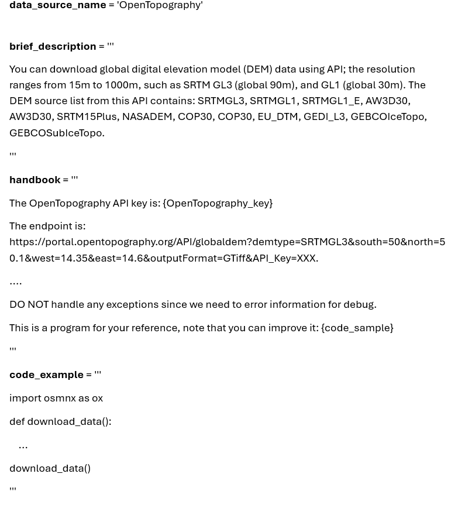
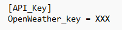

You can add your customized data source by adding an associated handbook following these requirements.

# Handbook format

A handhook consists of three required parts: `data_source_name`, `brief_dexription`, and `handbook`, being stored as a `.toml` format.

## `data_source_name`
A short, meaningful, and human readable name, for example, `OpenStreetMap`', `US_Census_demography`, `US_Census_boundary`, `OpenTopography`, `OpenWeather`, `COVID_NYT`, and `ESRI_world_imagery`. 

## `brief_description`
Provide a brief description (1 line) of the data source to inform AI whether need to use this data source.Need to contain critical information such as extent and period. E.g., the `brief_description` for `COVID_NYT` data source is `US COVID-19 data by New York Times. Cumulative counts of COVID-19 cases and deaths in the United States, at the state and county level, over time from 2020-01-21 to 2023-03-23.`.

## `handbook`
Put the technical requirements or details for the data source. One line for a requirement. No need to number them. For example: 

`The COVID-19 cumulative death and case data can be accessed via: https://raw.githubusercontent.com/nytimes/covid-19-data/master/us-counties-{year}.csv, year can be 2021, 2022,and 2023.`

`he CSV columns are: date,county,state,fips,cases,deaths. The data line can be: 2020-01-21,Washington,53,1,0. Note that the data-type of "fips" column is string, while the "case" and "deaths" are integer. You need to store the data type correctly. `

`Put your reply into a Python code block. Explanation or conversation can be Python comments at the begining of the code block(enclosed by ```python and ```). The download code is only in a function named 'download_data()'. The last line is to execute this function.`

## An example of handbook


The most important work for a customized data source is making a workable handbook. We recommend you start with very simple requirements, and then use LLM-Find the test many cases to see what kind of error occurs, then refine or add more requirements. After you have finish the handbook, you can share it with friends or colleagues, so that their LLM-Find agent can access the data source very easy with natural language requests. 

## How to use API keys
Many data sources require API keys  to access. You need to store the keys separately for each source. For example, put the key for the data source of `OpenWeather` in the file of `OpenWeather.keys` in the `Keys` directory. E.g.,

You need to replace the `XXX` using your real key and name the key. In the requirements in the `handbook`, you need to use a placeholder as `{OpenWeather}` to indicate the API key. LLM-Find will replace that placeholder using the key in the `OpenWeather.keys` file. 

## How to use code example and other variables in a handbook
Similar to API key, you need a placeholder in the requirements in a handbook. For example, there is a requirement of `This is a program for your reference, note that you can improve it: {code_example}` in the `US_Census_demography.toml`, the placeholder of `{code_example}` will be replaced by the variable of `code_example` in the toml file. Also the placeholder of `{Census_variables}` will be replaced by the variable of `Census_variables` in the same toml file. Such a design aims to better organize and maintain the requirements in the handbook.
`
You need to replace the `XXX` using your real key and name the key. In the requirements in the `handbook`, you need to use a placeholder as `{OpenWeather}` to indicate the API key. LLM-Find will replace that placeholder using the key in the `OpenWeather.keys` file. 


# Handbook organization
All handbooks are stored in the `Handbooks` directory, and the associated API keys are stored in the `Keys` directory. 


