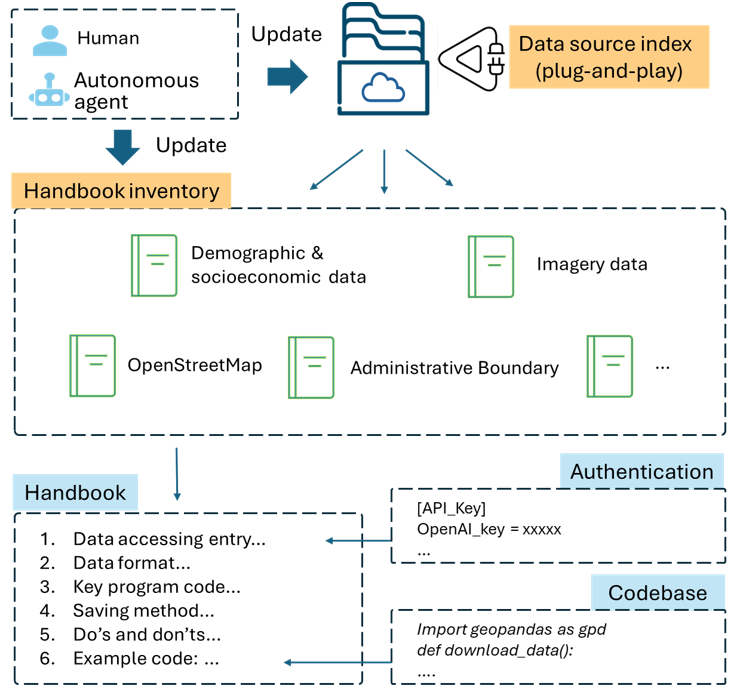
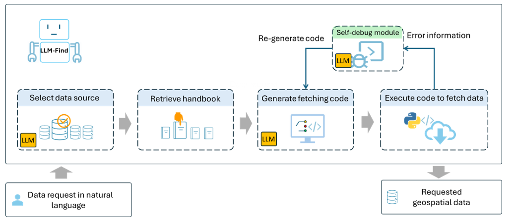
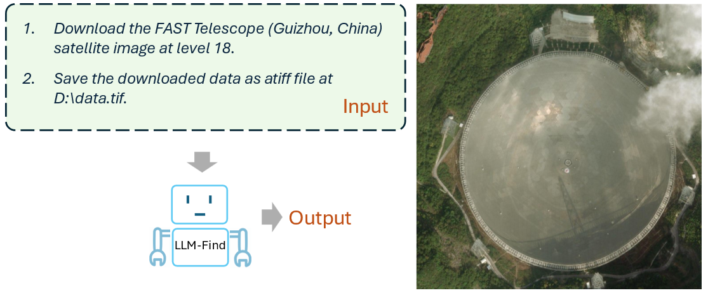
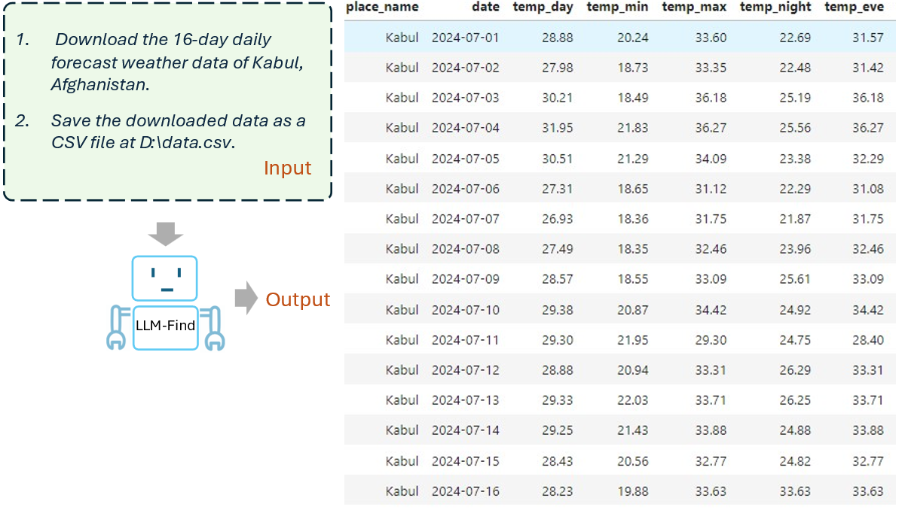
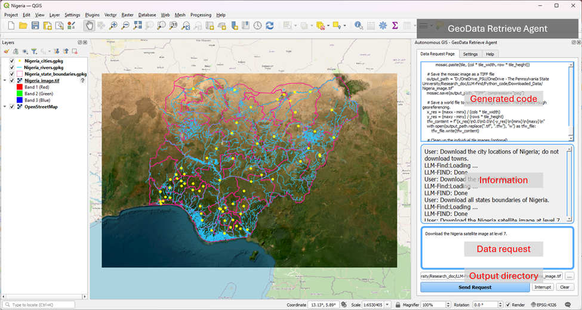

# An autonomous GIS agent framework for geospatial data retrieval

Geographic information system (GIS) users and analyst need to fetching geospatial data for analysis or research tasks. Data fetching can be time-consuming and label intensive. Is it possible to fetching with less pain and time? This study tried to create an autonomous fetching agent for GIS analysts and then make them more focus on their creative work.

This study proposes LLM-Find, an autonomous GIS agent framework to retrieve geospatial data by generating and executing programs with self-debugging. LLM-Find adopts an LLM as the decision maker to pick up the applicable data source from a list and then fetch data from the selected source. Each data source has a pre-defined handbook that records the metadata and technical details for data fetching. The proposed framework is flexible and extensible, designed as a plug-and-play mechanism; human users or autonomous data scrawlers can add a new data source by adding a new handbook. LLM-Find provides a fundamental agent framework for data fetching in autonomous GIS. We also prototyped an agent based on LLM-Find, which can fetch data from OpenStreetMap, COVID-19 cumulative cases from GitHub, administrative boundaries and demographic data from the US Census Bureau, weather data from a commercial provider, satellite basemap from ESRI World Imagery, and worldwid DEM from OpenTopography.org.

We tested various data cases; by accepting data requests in natural language, most of the requests got correct data in an about 80% - 90% success rate. We feel excited about that because the success of such data fetching  agent indicates that the data intensive GIS research or boarder scientific research can be executed by agents. Autonomous research agents can collect necessary online or local data and then conduce analysis parallely while adjust methods or strategies for better results. LLM-Find will be a foundational role in such a bright vision. 

QGIS users can download the QGIS plugin (AutonomousGIS-GeodataRetrieverAgent) to download the data via natural language in an GIS environment. Note that for some data source you may need to apply API keys. The source code of the QGIS plugin is [here](https://github.com/Teakinboyewa/AutonomousGIS_GeodataRetrieverAgent).
 
For more details, please refer to our paper: Ning, Huan, Zhenlong Li, Temitope Akinboyewa, and M. Naser Lessani. 2024. “LLM-Find: An Autonomous GIS Agent Framework for Geospatial Data Retrieval.” arXiv. https://doi.org/10.48550/arXiv.2407.21024.

Reference: [Autonomous GIS: the next-generation AI-powered GIS](https://www.tandfonline.com/doi/full/10.1080/17538947.2023.2278895). Recommended citation format: Li Z., Ning H., 2023. Autonomous GIS: the next-generation AI-powered GIS. Interntional Journal of Digital Earth. https://doi.org/10.1080/17538947.2023.2278895. GitHub repository: github.com/gladcolor/LLM-Geo

Note:  LLM-Find is under active development, and the ideas presented in the paper may change due to the rapid development of AI. We hope LLM-Find can inspire geospatial community to further investigate on autonomous GIS.    

LLM-Find framework

LLM-Find Agent workflow

# Installation

- Clone or download the repository, rename `your_config.ini` as `config.ini`. Then, put your OpenAI API key and other keys in the `config.ini` file. Please use GPT-4o, the lower versions may not have enough  ability to generate correct code.
- If you need to download data from [OpenWeather](https://openweathermap.org/api), [US Census](https://api.census.gov/data/key_signup.html), and [OpenTopography](https://opentopography.org/developers), please apply their API keys and put them in the `config.ini` file. 
- Install the Python packages in the top cell.

- If you have difficulties installing `GeoPandas` in Windows, refer to this [post](https://geoffboeing.com/2014/09/using-geopandas-windows/). 

# How to use
- Set the `downloaded_file_name` in LLM-Find.ipynb; extention is needed, space is not allowed. LLM-Find will save the downloaded data at this file.
- Put your data request to the `task` variable.
- Run all cells.
- LLM-Find will use the backed LLM (GPT-4o now) to generate and debug the data fetching program. GPT-4o's debugging ability is still weak. The default maximum attempt count is set to 10; modify this value is needed. 
- Tip 1: we suggest you re-run the program if LLM-Find cannot write the bug-free code. Per our observation, GPT sometimes will keep writing wrong code in a period about 10 minutes. Seems GPT will cache some previous answers so that it keeps return the same or similar wrong code.

# Case studies
Please try out the [provided cases (~70)](https://github.com/gladcolor/LLM-Find/blob/master/LLM_Find.ipynb), we also encourage you use your own cases. These case studies are designed to show the concepts of autonomous data fetching agents. Please use GPT-4o or above; the lower version of GPT will fail to generate the correct code and results. Note every time GPT-4o generates different outputs, your results may look different. Per our test, the generated program may fail at a chance about 10%; if so, please re-run all the cells again; no need to manually debug the code unless you like to do so. 

When fetching OpenStreetMap data and images, for those places do not use English, we encourage you to input the names written in local language. Such two data sources are more friendly correctly with the native language names than the English names. E.g., when retrieve Chinese placese, using Chinese language rather than Pinyin, since there are many same Pinyin for difference characters. Similarly, there are many places have the same name, such as "Columbia" in the USA. Therefore, please ensure your input place name is correct. You can use nominatim.openstreetmap.org to determine the correct name in OpenStreetMap. 

The LLM-Find agent downloaded satellite image of the FAST Telescope from ESRI World Imagery.

The LLM-Find agent downloaded 16-day daily weather forecast for Kabul, Afghanistan.

 The [The QGIS plugin of the GeoData Retrieve Agent](https://github.com/Teakinboyewa/AutonomousGIS_GeodataRetrieverAgent)) and the downloaded geospatial data of Nigeria,including cities (point), rivers (polyline), and state boundaries (polygon) from OpenStreetMap. The imagebasemap was downloaded from ESRI World Imagery using the plugin. Note that there are four individualdata requests to retrieve the shown data (e.g., “Download the rivers in Nigeria.”) 

# To Do
- Develop a data assessment module.
- Refactor the LLM_Find_Constants.py: split it out as individual data source and handbooks.
- Issue 1: We observed that GPT cannot correct the contaminated information even adding instructions in the prompt. E.g., it has about 50% chance to ignore the instruction of "using `relation(osm_id)` rather than `area(osm_id)`". Thus, we have to replace the string using Python code.
- Adding current time to the prompt.

# Note:

- You may need [OSMnx](https://osmnx.readthedocs.io/en/stable/) and [geopandas](https://geopandas.org/en/stable/getting_started.html#installation) packages to download and read vector files. Please install it in advance.
